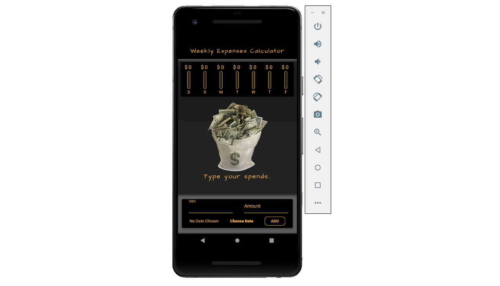
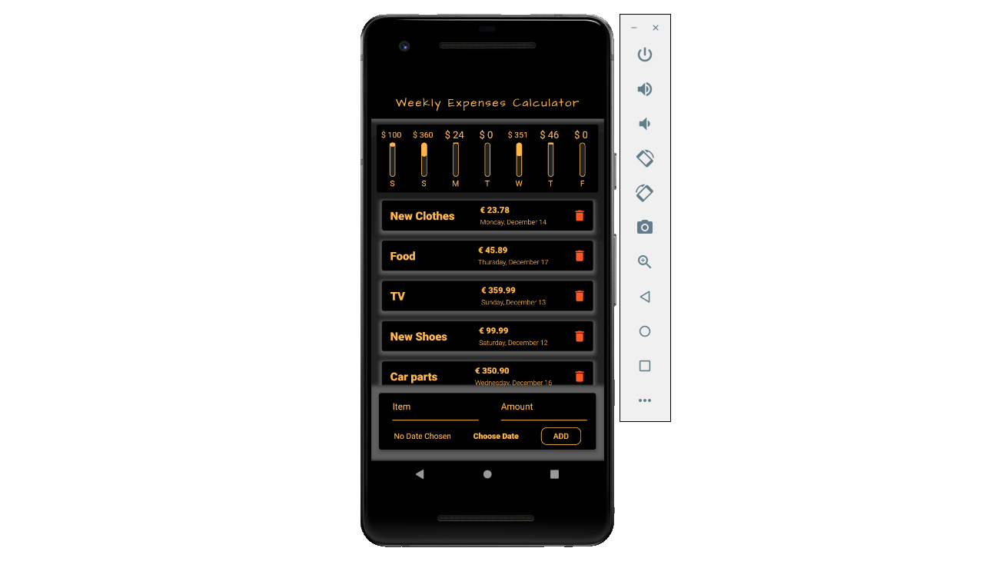
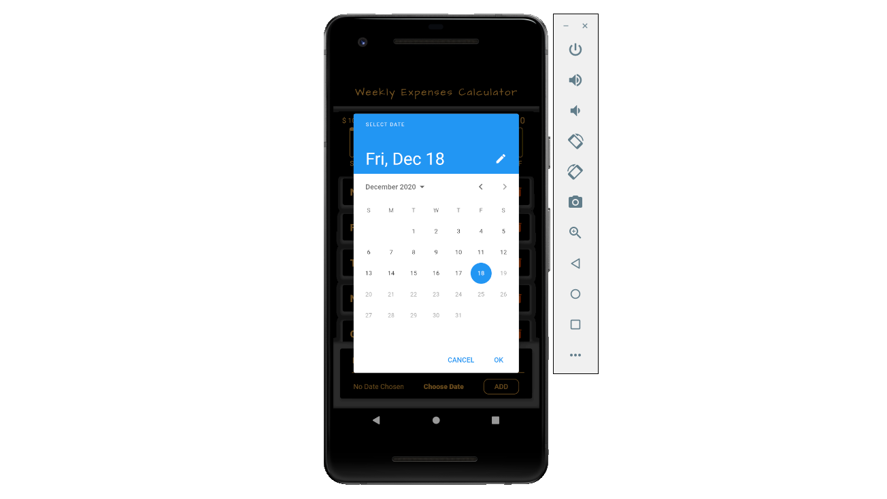

<h1>Weekly Expenses Calculator - Android App made with Flutter.</h1>

Your weekly expenses calculator made with Flutter using Dart programming language. Flutter is a Cross-Platform Android, iOS, Web, and Desktop Apps Development Framework. The apps created with this tool are of high quality and with native experience at 60 frames per second. In this App, you can add your weekly expenses, and the program automatically shows a diagram with percentages from total spend in the week. 

 

